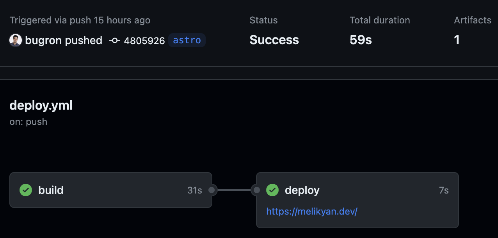

I've been delaying setting up my personal blog for so long that a few days ago I finally decided to do something about it 😅 And I'm glad I did because I finally got my hands dirty with [Astro][astro] and [Starlight][starlight] for the first time.

If you're interested in following my journey I invite you to read this article.

## Used technologies

Here is the list of tech I used to create this blog:

- [Astro][astro] - "a web framework for content-driven websites"
- [Starlight][starlight] - an Astro template for building documentation websites
- [GitHub Pages][githubPages] - a static site hosting service that takes HTML, CSS, and JavaScript files straight from a repository on GitHub. Conveniently, GitHub Pages supports custom domains, HTTPS, etc. and comes included in any GitHub plan.
- [GitHub Actions][githubActions] - a CI/CD tool that helps you automate your software development workflows
- [Google Analytics][googleAnalytics] - a web analytics service offered by Google that tracks and reports website traffic

### Astro

[Astro][astro] is a modern web framework that allows you to build faster websites with less client-side JavaScript. It takes content from anywhere (Markdown, MDX, CMS, etc.) and turns it into blogs, static sites, even web apps. Since [Markdown and MDX files][astroMarkdownContent] are supported by Astro out of box that's what I decided to use as the "content layer" for my blog.

It's very easy to start a new Astro project with their CLI:

```bash
npm create astro@latest
```

### Starlight
Instead of vanilla Astro I opted in using [Starlight][starlight] that is an official "wrapper" on top of it for building documentation websites (similar to [Docusaurus][docusaurus] and others). Interestingly, Starlight is just a template for Astro that you can install with the same Astro CLI:

```bash
npm create astro@latest -- --template starlight
```

I also found out that [starlight-blog][starlightBlog] package seamlessly adds blogging capabilities. Starlight's stellar (pun intended) features like [i18n][mdni18n], [full-text site search][starlightSiteSearch], visual mode switch, and many more are all supported out of box. That meant less work for me to get the blog going so I was sold right away.

[starlight-blog][starlightBlog] actually required some [more work][starlightBlogCommit] to get it running with latest Astro versions, but everything seems to function nicely so far.

BTW I used Starlight's [theme editor][starlightThemeEditor] to customize the colors of my blog. It's pretty neat.

### GitHub Pages
I decided to go with [GitHub Pages][githubPages] as a hosting provider for the blog because it's easy to setup and maintain, and it supports custom domains and HTTPS. I also use GitHub for my code so it was a natural choice for me.

I've never used custom domains with GitHub Pages before so I had to do some research. I found [this article][githubPagesCustomApexDomain] in GitHub docs that explains how to do it. It's pretty straightforward.

Next, I added `public/CNAME` with the melikyan.dev domain name to `bugron.github.io` repository as per [Astro documentation][astroGithubPagesWithCustomDomain].

[My domain's][blogUrl] DNS records needed an update too so that GitHub could recognize it. I use [Porkbun][porkbun] for my domains and they have a [guide][porkbunGithubPagesWithCustomDomain] on how to configure custom domains with GitHub Pages as well. Sweet.

In case you're asking why Porkbun not only they provide good service they're also fun. Just look at this "warning" (you can find it in the footer of their pages) 😂


As I previously had something deployed to [bugron.github.io][blogGithubUrl] from the `main` branch and I wanted to use GitHub Actions to deploy my blog I had to change the source in GitHub Pages to `GitHub Actions`. 

Additionally, I updated the deployment branch rule of `github-pages` environment (you can find environments in repository settings, `Environments` under the `Code and automation` section) to point to the new `astro` branch otherwise the deployment simply wouldn't happen 🤷‍♂️

Now we're all set to actually deploy our blog to GitHub Pages.

### GitHub Actions
Astro conveniently provides [a guide][astroGithubActions] on how to deploy an Astro static site to GitHub Pages using [GitHub Actions][githubActions].

Now for the `lastUpdated` configuration to work as expected we want to fetch the whole git history so we need to slightly modify the [provided workflow][astroGithubActions]:

```yaml title=".github/workflows/deploy.yml" ins={22,23}
name: Deploy Astro blog to GitHub Pages

on:
  # Trigger the workflow every time you push to the `main` branch
  # Using a different branch name? Replace `main` with your branch’s name
  push:
    branches: [ astro ]
  # Allows you to run this workflow manually from the Actions tab on GitHub.
  workflow_dispatch:

# Allow this job to clone the repo and create a page deployment
permissions:
  contents: read
  pages: write
  id-token: write

jobs:
  build:
    runs-on: ubuntu-latest
    steps:
      - uses: actions/checkout@v4
        with:
          fetch-depth: 0 # Only a single commit is fetched by default, for the ref/SHA that triggered the workflow. Set fetch-depth: 0 to fetch all history for all branches and tags
      - name: Install, build, and upload your site
        uses: withastro/action@v1
  deploy:
    needs: build
    runs-on: ubuntu-latest
    environment:
      name: github-pages
      url: ${{ steps.deployment.outputs.page_url }}
    steps:
      - name: Deploy to GitHub Pages
        id: deployment
        uses: actions/deploy-pages@v1
```

After adding the deployment workflow file I committed it to the `astro` branch and pushed it to GitHub. The workflow started automatically and after a a minute or so my blog was live at [melikyan.dev][blogUrl].



It's time to publish some articles 🚀

## Conclusion

And that's it! No, I did not forget about Google Analytics but so much had been said about how to integrate it into websites that I don't think we need another guide for it 😉

Now you know how to quickly setup a blog with Astro, Starlight, and GitHub Pages. I hope this article was helpful. Until next time!

{/* URL section */}
[blogUrl]: https://melikyan.dev/
[blogGithubUrl]: https://bugron.github.io/
[porkbun]: https://porkbun.com/
[porkbunGithubPagesWithCustomDomain]: https://kb.porkbun.com/article/160-how-to-configure-a-github-pages-apex-domain/
[astro]: https://astro.build/
[astroGithubPagesWithCustomDomain]: https://docs.astro.build/en/guides/deploy/github/#using-github-pages-with-a-custom-domain
[astroMarkdownContent]: https://docs.astro.build/en/guides/markdown-content/
[astroGithubActions]: https://docs.astro.build/en/guides/deploy/github/#configure-a-github-action
[starlight]: https://starlight.astro.build/
[starlightSiteSearch]: https://starlight.astro.build/guides/site-search/
[starlightThemeEditor]: https://starlight.astro.build/guides/css-and-tailwind/#color-theme-editor
[starlightBlog]: https://github.com/HiDeoo/starlight-blog/
[starlightBlogCommit]: https://github.com/bugron/bugron.github.io/commit/198655907405470434e18bdefedc4e9d7338cf49/
[githubPages]: https://pages.github.com/
[githubPagesCustomApexDomain]: https://docs.github.com/en/pages/configuring-a-custom-domain-for-your-github-pages-site/managing-a-custom-domain-for-your-github-pages-site#configuring-an-apex-domain
[githubActions]: https://docs.github.com/en/actions/
[googleAnalytics]: https://analytics.google.com/
[docusaurus]: https://docusaurus.io/
[mdni18n]: https://developer.mozilla.org/en-US/docs/Glossary/Internationalization/
